# CK3 UI Modding — Setup and Reference Guide

A practical, end-to-end guide to modding Crusader Kings III's user interface: tooling setup, inspecting the live UI, the `.gui` language, layout, data binding, connecting UI to script, and shipping new windows.

> Adapted from the [CK3 Paradox Wiki — Interface](https://ck3.paradoxwikis.com/Interface) (CC BY-SA 3.0, via the [ck3-modding-wiki](https://github.com/jesec/ck3-modding-wiki) Markdown mirror), extended with workflow notes for this extension. Reference images are from the same source; see the attribution note at the end.

---

## 1. What UI modding can and cannot do

**You can:** restyle the interface, make windows movable/resizable, remove or rearrange elements, add new buttons, surface more information from the game, and add entirely new windows.

**You cannot:** create a new HUD skin (`.skin` files in mods are ignored), add new hotkeys (`.shortcuts` files in mods are ignored — you can only reuse existing ones), or display information from one window inside another unless the developers exposed it.

Two facts to plan around:

- UI mods change the **checksum** (multiplayer players need the same mods). Since patch 1.9 they no longer disable achievements.
- Vanilla `.gui` files are replaced whole-file by mods, so two UI mods touching the same file conflict — see [§10 Mod compatibility](#10-templates-types-and-mod-compatibility) for the hook pattern that mitigates this.

## 2. Toolchain setup (do this once)

### Launch options

Add `-debug_mode -develop` to the game's Steam launch options (right-click CK3 → Properties → Launch Options). This enables the console **and hot reload**: every time you save a `.gui` file, the running game reloads it instantly.

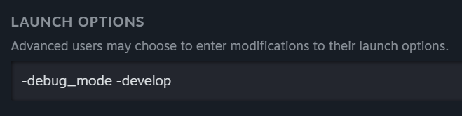

### Jump from game to editor

Both UI inspectors can open the exact file *and line* of an element in your text editor:

1. Copy the full path of your editor's exe (for VS Code: `C:\Users\<you>\AppData\Local\Programs\Microsoft VS Code\Code.exe`).
2. Open `Documents\Paradox Interactive\Crusader Kings III\pdx_settings.txt`.
3. Find the `editor` entry and set its value to that path.
4. In `editor_postfix` below it, set the value to `:$:1` — that's what makes VS Code jump to the line.
5. Save; restart the game if it was running.

### Console commands you'll live in

| Command | Effect |
| --- | --- |
| `dump_data_types` | Dumps every GUI promote/function to `Documents/.../logs/data_types/` — this is the API reference for data binding. Merge them for searching: run `type *.txt > ALL_DATA_TYPES.txt` in that folder. |
| `tweak gui.debug` | Opens the tweaker; check only *GUI.Debug* for the element inspector (§3). |
| `release_mode` | Toggles an on-screen error counter — your first stop when the UI silently breaks. |
| `gui_editor` | Opens the in-game GUI editor (also Ctrl+F8). |
| `reload gui` / `reload texture` | Manual reload; rarely needed with hot reload on. |

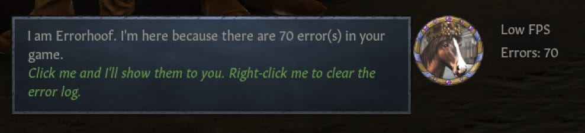

### Working files

- UI definitions: `game/gui/*.gui` — plain text, brace-based, edited with any editor (this extension's CK3 language modes apply to your mod's files).
- Textures: `game/gfx/**` as `.dds` (PNG also accepted in many places). Edit DDS with GIMP or Photoshop with a DDS plugin.
- Keep `error.log` open while working, and keep the `data_types` dumps open for reference.

## 3. Inspecting the running UI

### gui.debug — the fast inspector

Run `tweak gui.debug`, check only **GUI.Debug** (the other options highlight everything at once and overwhelm the screen).

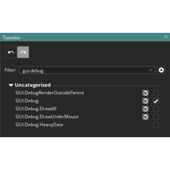

With it active, hovering highlights an element with a green border and a tooltip shows its defining file and line:

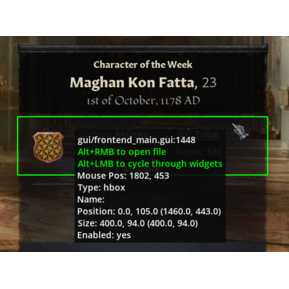

- **Alt + left-click** — cycle through overlapping elements above/below.
- **Alt + right-click** — open the `.gui` file in your editor at that line (needs the `pdx_settings.txt` setup from §2).

### GUI Editor — visual but limited

`gui_editor` or Ctrl+F8. An Outliner shows the widget hierarchy; a Properties window edits the selected element; the *UI Components* window is a palette of standard widgets, and *Registered Data Types* is a browsable function reference.

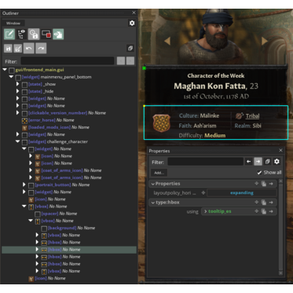

Tips and cautions:

- Edit mode ("E") behaves like a browser's inspect mode; scroll the wheel to change focus depth (hud.gui loves to get in the way); light blue border = selection.
- Hold right mouse button to move an element; Ctrl+Z undoes; red stars in the Outliner mean unsaved changes; Ctrl+S saves — **make sure the file lives in your mod**, or the editor writes into the game folder (repair via Steam "Verify integrity" if that happens).
- If the Properties header starts with `type:` you have selected a **template** — editing it changes every instance in the game. Usually not what you want.

The community consensus (and the wiki's) is: use gui.debug to find things, edit the raw text, keep the GUI editor for exploration.

## 4. Creating a GUI mod

1. Create a mod via the launcher (Mod library → Upload Mod → Create a Mod) — this creates the folder and `.mod` file under `Documents/Paradox Interactive/Crusader Kings III/mod`.
2. Create a `gui/` folder in your mod and copy into it *only the vanilla files you actually change* from `game/gui/`.
3. Find which file owns an element with gui.debug (§3).

## 5. The .gui language in five minutes

The UI is a tree of containers and elements; think HTML with braces:

```
widget = {
	size = { 50 50 }
	alpha = 0.5
}
```

- Order matters: **later in the file = drawn on top**.
- Children move with their parent; position is relative to the parent's top-left corner unless changed with `parentanchor` (`left`, `right`, `top`, `bottom`, `hcenter`, `vcenter`, combinable: `parentanchor = right|vcenter`).
- Open/close braces at the same indentation level, contents one tab in — brace-mismatch is the #1 crash cause, and consistent style lets you fold blocks in the editor.

## 6. Component reference

The everyday containers and elements (vanilla's premade *types* built on them live in `gui/shared/`, previewable in-game via Release Mode → **UI Library** button):

| Component | Behavior |
| --- | --- |
| `window` | Movable container (`movable = yes`); fixed size or resized by children; background via templates (`using = Window_Background`); children outside its bounds need `allow_outside = yes` to stay clickable; click brings it to front. |
| `widget` | Static container; like a window that doesn't raise on click. |
| `margin_widget` | Widget sized via margins — the trick for windows that adapt to any screen size (height 100%, margins ≈ 50 for the HUD). |
| `container` | No fixed size; auto-fits children (including invisible ones unless `ignoreinvisible = yes`); used to group and move elements together. |
| `flowcontainer` | Lays children out in a row (`direction = vertical` for a column); children cannot have manual positions. |
| `hbox` / `vbox` | The workhorses — see §7. Spread children along their axis, respect layout policies, accept datamodels. |
| `dynamicgridbox` | Datamodel-only list, variable item sizes; laggy with very long lists. |
| `fixedgridbox` | Datamodel-only table with fixed cell size; much faster for long lists; hidden items leave gaps. |
| `overlappingitembox` | Datamodel-only row that overlaps items when space runs out (think portrait stacks). |
| `scrollarea` | Scrollbars on demand; vanilla mostly uses the `scrollbox` type (scrollarea + background + margins). |
| `button` | Clickable; `onclick` / `onrightclick` (add `button_ignore = none` for right-click); sizeless buttons make invisible hotkey targets. |
| `icon` | Draws a texture; can hold children; `mirror = horizontal|vertical`. |
| `textbox` | Text; `multiline = yes`, `elide = right`; prefer vanilla types like `text_single` from `gui/shared/text.gui` for consistent styling. |

## 7. Layout: hbox/vbox and layout policies

Almost every window is a `vbox` arranging content vertically. Boxes center themselves and their children — **never** use `parentanchor` inside them; push content aside with an `expand = {}` spacer instead.

Five policies per axis (`layoutpolicy_horizontal`, `layoutpolicy_vertical`):

1. `fixed` (default) — keeps size; the box itself then hugs its children.
2. `expanding` — grows to the parent, never below original size; multiple expanding children split space equally; highest priority.
3. `growing` — like expanding but yields to expanding siblings (this is what `expand = {}` uses).
4. `preferred` — grows *and* shrinks with available space.
5. `shrinking` — can shrink below original size, never grows.

Behavior gallery (black background = the hbox):

| Code | Result |
| --- | --- |
| `hbox = { button_round = {} button_round = {} }` — default hugs children |  |
| `layoutpolicy_horizontal = expanding` on the hbox — fills parent, spreads children |  |
| …plus `expand = {}` after the children — pushes them to one side | 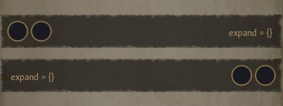 |
| `expanding` on the children too — resizes them equally (instant tab bar) | 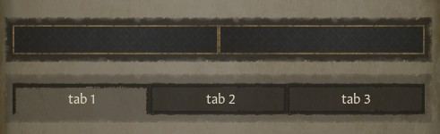 |
| `expanding` both axes on box and children — fills everything | 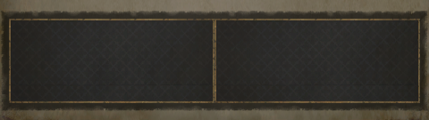 |
| `expanding` vs `growing` sibling — expanding wins, growing keeps its floor | 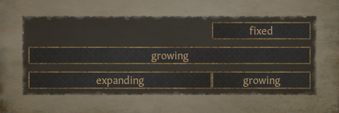 |
| `preferred`/`shrinking` under pressure — both give up space | 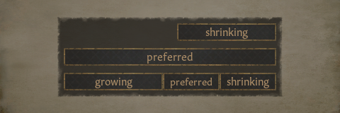 |

**Text stretches layouts.** Long German/Russian strings are the classic breakage: set `max_width` on textboxes and test with the built-in `LOREM_IPSUM_TITLE` / `LOREM_IPSUM_DESCRIPTION` loc keys.

## 8. Animation states

```
state = {
	name = _show
	alpha = 0.5
	duration = 0.5
}
```

States change properties over `duration`, can `start_sound = { soundeffect = "event:..." }`, and can run functions via `on_start` / `on_finish` (prefer `on_finish` — `on_start` currently fires twice).

Auto-firing names: `_show`, `_hide`, `_mouse_hierarchy_enter/leave`, `_mouse_press/click/release`, `daily_tick`, `monthly_tick`. Any other name is fired manually:

- `onclick = "[PdxGuiWidget.TriggerAnimation('my_state')]"` — state inside the same widget.
- `onclick = "[PdxGuiTriggerAllAnimations('my_state')]"` — every visible state with that name, across windows.
- `trigger_when = ...` / `trigger_on_create = yes` — condition-driven.

Easing uses a cubic bezier; vanilla's `Animation_Curve_Default` is `bezier = { 0.25 0.1 0.25 1 }` (try curves at [cubic-bezier.com](https://cubic-bezier.com/#.25,.1,.25,1)):

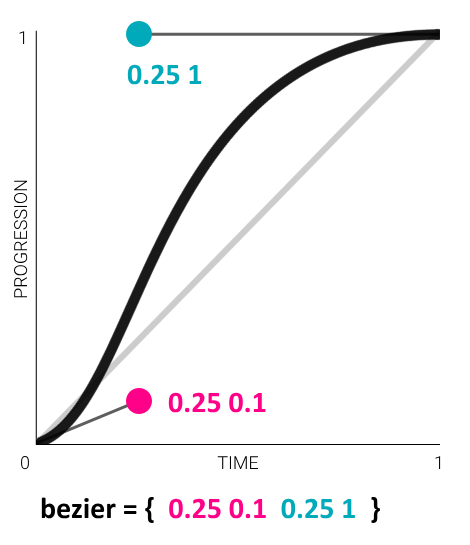

## 9. Data binding: promotes and functions

Everything dynamic in the UI comes from **promotes** (return a game object: `GetPlayer`, `CharacterWindow.GetCharacter`) and **functions** (return values: `GetGold`, `GetNameNoTooltip`), chainable like:

```
CharacterWindow.GetCharacter.GetPrimaryTitle.GetHeir.GetPrimarySpouse.GetFather
```

The full per-window API is whatever `dump_data_types` wrote to your logs folder — treat those files as the documentation.

- Set `datacontext = "[CharacterWindow.GetCharacter]"` on a container and children can use the short form: `text = "[Character.GetGold]"`.
- UI values are typed (int32, CFixedPoint, float, CString…); cast with functions like `IntToFixedPoint`, `FixedPointToFloat` when a property demands a specific type (`alpha` wants float).
- Formatting suffixes in text bindings: `|1` (decimals), `|%` (percentage), `|=` / `|+` (color by sign), `|O` (ordinal: `2nd`).
- Numbers→strings has no vanilla function; the standard workaround routes the value through a `common/customizable_localization` entry (and a `data_binding/` macro makes it reusable) — see the wiki's [Casting numbers to strings](https://ck3.paradoxwikis.com/Interface#Casting_numbers_to_strings).

## 10. Templates, types, and mod compatibility

- `template Name { ... }` — reusable property block, inserted with `using = Name`. Global across all `.gui` files (`local_template` for file-local).
- `types AnyGroupName { type my_text = textbox { ... } }` — reusable whole elements, used as `my_text = { ... }`.
- `block "name" { ... }` inside a template + `blockoverride "name" { ... }` at the usage site customizes one part of an instance without forking the template. Empty override removes the block.
- **Replace** a vanilla template/type without shipping the whole vanilla file: define it in a file that sorts *first* alphabetically (`gui/00_my_overrides.gui`).

**Compatibility hook pattern:** since whole-file replacement makes UI mods clash, put your additions into your own types/templates in your own file, and insert a single usage line (`using = my_mods_template` or `my_mods_type = {}`) into the shared vanilla file. Another mod including that same line stays compatible with yours whether or not your mod is loaded (an absent template logs one error at boot and renders nothing). Frameworks like [Unified UI](https://steamcommunity.com/sharedfiles/filedetails/?id=2620284839) and the [GUI Modding Framework](https://steamcommunity.com/sharedfiles/filedetails/?id=2422260973) institutionalize this pattern — target them if you want your mod to coexist in large playsets.

## 11. Lists: datamodels

```
dynamicgridbox = {
	datamodel = "[GetPlayer.MakeScope.GetList('secret_society')]"
	item = {
		flowcontainer = {
			datacontext = "[Scope.GetCharacter]"
			portrait_head_small = {}
			text_single = { text = "[Character.GetNameNoTooltip]" }
		}
	}
}
```

- `datamodel` feeds a list into `vbox`/`hbox`/`flowcontainer`/`dynamicgridbox`/`fixedgridbox`/`overlappingitembox`; each entry renders the `item` block. Inside items, unwrap the element with `Scope.GetCharacter` (or `Scope.Title`, etc.) — set as `datacontext` on the widget *inside* `item`, not on `item` itself.
- `datacontext` = one object; `datamodel` = a list. Don't confuse them.
- Many vanilla lists are hardcoded (no adding/sorting); items can at least be hidden via `visible`, but grid boxes leave gaps. Custom sorting means building your own variable list in script (`add_to_variable_list`, `ordered_in_list`) and displaying that.
- `datacontext_from_model = { datamodel = ... index = "1" }` picks a single item out of a list.

## 12. Scripted GUIs — the bridge from UI to script

Scripted GUIs (`common/scripted_guis/*.txt`) are effect/trigger bundles the UI can run — the way buttons change actual game state:

```
toggle_my_window = {
	scope = character
	effect = {
		if = { limit = { has_variable = show_my_window } remove_variable = show_my_window }
		else = { set_variable = show_my_window }
	}
	is_shown = { ... }    # optional visibility trigger
	is_valid = { ... }    # optional enable trigger
}
```

Hooked up from `.gui` (declare `datacontext = "[GetScriptedGui('toggle_my_window')]"` once, then):

```
onclick = "[ScriptedGui.Execute( GuiScope.SetRoot( GetPlayer.MakeScope ).End )]"
visible = "[ScriptedGui.IsShown( GuiScope.SetRoot( GetPlayer.MakeScope ).End )]"
enabled = "[ScriptedGui.IsValid( GuiScope.SetRoot( GetPlayer.MakeScope ).End )]"
tooltip = "[ScriptedGui.BuildTooltip( GuiScope.SetRoot( GetPlayer.MakeScope ).End )]"
```

- Extra scopes: `.AddScope( 'target', CharacterWindow.GetCharacter.MakeScope )` → used as `scope:target` in the sgui. Values/flags/booleans cross over via `MakeScopeValue` / `MakeScopeFlag` / `MakeScopeBool`.
- **No space before `(` or `.`** in these bindings — `Execute (` silently breaks.
- Show script data directly: `text = "[GetPlayer.MakeScope.Var('var_name').GetValue|1]"` or `"[GetPlayer.MakeScope.ScriptValue('sval_name')|0]"`. Script values in UI recalculate **every frame** — prefer variables inside big lists.

## 13. Shipping a new window

The clean, mod-friendly recipe:

1. **Define the window** in its own file, e.g. `gui/my_window.gui`:

   ```
   window = {
   	name = "my_window"
   	layer = top
   	using = Window_Size_MainTab
   	using = Window_Background_Sidebar
   }
   ```

2. **Register it as a scripted widget** — create `gui/scripted_widgets/my_windows.txt` containing:

   ```
   gui/my_window.gui = my_window
   ```

   The game spawns it automatically at map load (one line per widget — buttons work too).

3. **Toggle visibility** — pick one:
   - *UI variable system* (fastest, resets on game restart): window `visible = "[GetVariableSystem.Exists('show_my_window')]"`, button `onclick = "[GetVariableSystem.Toggle('show_my_window')]"`. The system also does tabs: `Set('gui_tabs','tab_2')` + `HasValue('gui_tabs','tab_2')` per tab pane, with a `_show` state or `Not(Exists(...))` pane for the default tab.
   - *Script variables + scripted GUI* (persists in the save): `visible = "[GetPlayer.MakeScope.Var('show_my_window').IsSet]"` with the toggle sgui from §12.
   - `PdxGuiWidget.Show/Hide/FindChild` chains or animation-based toggles for purely cosmetic cases — verbose but dependency-free.

4. Since the window exists before a character is selected, guard player-scoped bindings: wrap the window in a full-size `alwaystransparent = yes` widget with `visible = "[GetPlayer.IsValid]"`.

The remaining pain is *opening* it: a button has to live somewhere in an existing file (hud), which is where the compatibility hooks from §10 (or Unified UI) come in; decisions/interactions are the no-conflict fallback.

## 14. Troubleshooting

Known **crash** causes:

- `size = { 100% 100% }` on an hbox/vbox (use layout policies instead).
- An hbox/vbox inside a `flowcontainer`.
- `resizeparent = yes` on more than one child of the same parent — even if only one is visible.
- A type that references itself (endless loading screen until RAM runs out).
- Plain syntax errors: count `{` vs `}`; with regex search, `= \[` and `\]\n` (hunting unquoted square brackets) catch most missing quotes.

Non-crash debugging: `release_mode` error counter on screen, `error.log` open in the editor, `gui.debug` to confirm which file an element really comes from (another mod may be overriding yours).

## 15. Reference: existing game views

Names usable with `OpenGameView` / `IsGameViewOpen('...')`: `intrigue_window`, `military`, `men_at_arms`, `knights`, `levy`, `army`, `holding_view`, `character`, `character_finder`, `combat`, `end_of_combat`, `siege`, `raid`, `rally_point`, `find_title`, `character_focus`, `lifestyle`, `decisions`, `decision_detail`, `title_view_window`, `war_overview`, `struggle`, `pause_menu`, `council_window`, `dynasty_house_view`, `dynasty_tree_view`, `dynasty_legacy_window`, `factions_window`, `lineage_view`, `religion`, `faith`, `faith_creation`, `faith_conversion`, `culture_window`, `hybridize_culture`, `diverge_culture`, `great_holy_war`, `outliner`, `my_realm`, `succession_law_change`, `designate_heir`, `barbershop`, `title_history`, `kill_list`, `court_window`, `ruler_designer`, `royal_court`, `inventory`, `artifact_details`, `memories`, `activity_planner`, `activity_window`, `travel_planner`, `accolade_view`, `diarchy`, `manage_tax_slots` — and more; the full table is on the [wiki page](https://ck3.paradoxwikis.com/Interface#List_of_existing_game_views).

## 16. Suggested workflow with this extension

1. Copy the target vanilla `.gui` file into your mod's `gui/` folder (it gets the CK3 language mode, brace matching and folding automatically).
2. Run the game with `-debug_mode -develop`; use `gui.debug` + Alt+right-click to land in the right file/line in VS Code.
3. Edit → save → the game hot-reloads; watch the `release_mode` error counter and `error.log`.
4. Anything stateful goes through a scripted GUI in `common/scripted_guis/` — where this extension's completion, context filtering (`effect`/`is_shown`/`is_valid` blocks) and tiger diagnostics apply.
5. UI-visible text goes through localization — inlay hints show the resolved strings inline, and `CK3 Localization: Add Language` scaffolds other languages when you ship.

## Further resources

- [Interface — CK3 Wiki](https://ck3.paradoxwikis.com/Interface) — the canonical, maintained version of this material.
- [Modding — CK3 Wiki](https://ck3.paradoxwikis.com/Modding) — general modding entry point.
- [UI Library mod](https://steamcommunity.com/sharedfiles/filedetails/?id=2579010074) — live catalogue of the hbox/vbox layout examples in §7.
- [GUI Modding Framework](https://steamcommunity.com/sharedfiles/filedetails/?id=2422260973) and [Unified UI](https://steamcommunity.com/sharedfiles/filedetails/?id=2620284839) — compatibility frameworks for shipping UI mods.
- [Customizable GUI](https://steamcommunity.com/sharedfiles/filedetails/?id=2834463679) — example of a heavily toggle-driven UI mod.
- [awesome-ck3](https://github.com/my-mods/awesome-ck3) — community-curated resource list.
- [Dev Diary #87: Royal Modding](https://www.paradoxinteractive.com/games/crusader-kings-iii/news/dev-diary-87-royal-modding) — the developers on scripted widgets.
- [rgbcolorpicker.com/0-1](https://rgbcolorpicker.com/0-1) — normalized 0–1 color picker for `tintcolor` and friends.
- CK3 Mod Co-op Discord — linked from the wiki's modding page.

---

*Text adapted from the [CK3 Paradox Wiki](https://ck3.paradoxwikis.com/Interface) under [CC BY-SA 3.0](https://creativecommons.org/licenses/by-sa/3.0/); images in `images/` are from the wiki via the [ck3-modding-wiki](https://github.com/jesec/ck3-modding-wiki) mirror and remain under the same license. This guide is likewise CC BY-SA 3.0.*
