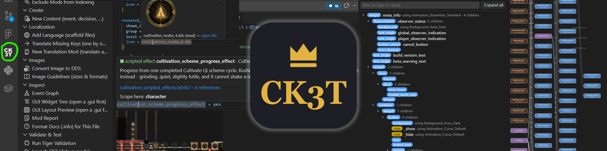

<div align="center">



# CK3 Modding Toolkit for VS Code

Crusader Kings III mod development, end to end: a language server with a real
Paradox-script parser, scope-aware completion, instant diagnostics for the
silent-failure class of bugs, deep [ck3-tiger](https://github.com/amtep/tiger)
integration, a live mod overview, and a localization workflow no other tool has.

[](LICENSE)


</div>

> **Early alpha (0.1.1).** This is a young project and things will change. It is
> already useful day to day, but you will hit rough edges. Feedback is not just
> welcome, it is the point: see [Contributing](#contributing--feedback) below.

## Highlights

- **Scope-aware completion**: key positions offer verbs (triggers/effects),
  value positions offer nouns (traits, events, on_actions, loc keys), and
  `scope:`, `culture:`, `title:` prefixes complete their referents. Items valid
  in the current scope rank first; others are annotated, never hidden.
- **Hover docs with texture previews**: merged `script_docs` and wiki docs, the
  live scope chain at the cursor, resolved loc text, and inline `.dds` image
  previews from a pure-TS DDS decoder.
- **Structural diagnostics** for the bugs the game swallows silently: unbalanced
  braces, missing UTF-8 BOM, loc header/filename mismatches, folder traps
  (`localisation/`, plural `on_actions`), references to events that do not exist.
- **Deep ck3-tiger integration**: auto-download, run on save or manually, JSON
  reports as native Problems, and a baseline workflow to adopt tiger on a legacy
  mod (suppress today's reports, see only new ones).
- **CK3 sidebar**: mod overview, localization coverage, overrides and conflicts
  (with the LIOS/FIOS winner), an interactive event graph with a node inspector,
  and a GUI widget tree.
- **DDS and images**: zoomable `.dds` preview, a PNG/JPEG/WebP to DDS converter
  in the explorer right-click menu, and `CK3: Show Image Guidelines` with the
  sizes vanilla actually uses.
- **Localization workflow**: inline loc as inlay hints, BOM-correct quick-fix
  editing, a coverage view, and scaffolds for whole translation mods.
- **Content scaffolds**: `CK3: New Content` generates events, decisions,
  interactions and on_action hooks that are correct by construction.
- **Live debugging**: `CK3: Launch CK3 (debug mode)` plus a `CK3: Toggle
  error.log Watcher` that surfaces in-game script errors as editor squiggles.
- **GUI and data types** in `.gui` files: completion, hover, widget tree, and
  `[Character.GetFather...]` data-type chains that resolve through return types.
- **Multi-mod workspaces**: every workspace mod is a first-class mod, indexed
  together, with per-mod tiger baselines and no "primary mod" to configure.
- **Bundled 10-chapter tutorial** (`CK3: Open Tutorial`) with every snippet
  verified against the game files.
- **A [Claude/agent skill for CK3 modding](https://github.com/JDeffner/ck3-modding-toolkit/wiki/Claude-Skill)**
  ships in `skills/ck3-modding/` for AI-assisted modding.

## Quick start

1. Install the extension, open your mod folder, and run **CK3: Run Setup &
   Health Check**. It finds the game via Steam, checks the logs folder, and
   offers to download ck3-tiger. The walkthrough covers the rest.
2. *(Recommended)* Launch CK3 with `-debug_mode`, open the console (\`), run
   `script_docs`, then run **CK3: Reload Game Data (script_docs)**. This upgrades
   the token data from the bundled wiki lists to your exact game version.

The default configuration is nothing: open your mod folder(s), run Setup once,
and everything else is optional. Full walkthrough and every setting are in the
wiki: **[Getting Started](https://github.com/JDeffner/ck3-modding-toolkit/wiki/Getting-Started)**
and **[Configuration](https://github.com/JDeffner/ck3-modding-toolkit/wiki/Configuration)**.

## Documentation

The full docs live in the
[wiki](https://github.com/JDeffner/ck3-modding-toolkit/wiki):

- [Home](https://github.com/JDeffner/ck3-modding-toolkit/wiki/Home)
- [Getting Started](https://github.com/JDeffner/ck3-modding-toolkit/wiki/Getting-Started)
- [Editor Features](https://github.com/JDeffner/ck3-modding-toolkit/wiki/Editor-Features)
- [Sidebar Views](https://github.com/JDeffner/ck3-modding-toolkit/wiki/Sidebar-Views)
- [DDS and Images](https://github.com/JDeffner/ck3-modding-toolkit/wiki/DDS-and-Images)
- [Configuration](https://github.com/JDeffner/ck3-modding-toolkit/wiki/Configuration)
- [Multi-Mod and Translation](https://github.com/JDeffner/ck3-modding-toolkit/wiki/Multi-Mod-and-Translation)
- [Claude Skill](https://github.com/JDeffner/ck3-modding-toolkit/wiki/Claude-Skill)
- [Credits](https://github.com/JDeffner/ck3-modding-toolkit/wiki/Credits)

## Contributing & feedback

This is an alpha shaped by the people who use it. The best thing you can do is
tell me what breaks and what is missing:

- **File an [issue](https://github.com/JDeffner/ck3-modding-toolkit/issues)** for
  bugs, false diagnostics, or feature ideas. Concrete examples from real mods
  are gold.
- **PRs are welcome.** The schema table
  (`packages/server/src/schema/ck3Schema.ts`) is deliberately small and
  community-editable: adding a folder kind or loc requirement is a good first
  contribution.
- **Fork it and take inspiration.** If a piece of this is useful in your own
  tooling, use it. It is GPL-3.0-or-later, so keep distributed derivatives open.

### Dev quickstart

```
pnpm install
pnpm run compile      # esbuild bundles dist/extension.js (client) + dist/server.js
pnpm run typecheck
pnpm test             # vitest; copy dev-paths.example.json to dev-paths.json to also run the vanilla corpus suites
```

Layout (pnpm monorepo): `packages/vscode/` (this extension) ·
`packages/server/` (language server: parser, index, scopes, features, schema
table, bundled data) · `packages/protocol/` (types, wire protocol, shared
helpers) · `packages/*/test/` (vitest suites incl. corpus/fixture tests). The extension is a
client/server LSP split: the thin client runs in the extension host, all parsing
and analysis lives in a separate server process. Design rationale and the full
plan are in [`docs/rework-plan.md`](docs/rework-plan.md) and
[`docs/research.md`](docs/research.md).

## Acknowledgements

The extension stands on work by others. The key sources and inspirations:

- [ck3-tiger](https://github.com/amtep/tiger) by amtep, the validator behind the
  diagnostics integration.
- [cwtools](https://github.com/cwtools/cwtools) and cwtools-vscode, for the
  landscape and design inspiration.
- [jesec/ck3-modding-wiki](https://github.com/jesec/ck3-modding-wiki), the source
  of the bundled fallback token lists (CC BY-SA 3.0, see
  [ATTRIBUTION.md](https://github.com/JDeffner/ck3-modding-toolkit/blob/main/packages/server/data/ck3/wikidocs/ATTRIBUTION.md)).
- Paradox's own in-game `_*.info` format docs, the primary ground truth for the
  schema layers. No game assets are redistributed.

The complete table with licenses is on the
[Credits wiki page](https://github.com/JDeffner/ck3-modding-toolkit/wiki/Credits).

## License

GPL-3.0-or-later. In short: use, modify and redistribute freely, but any
distributed fork or derivative must publish its source under the GPL too. See
[LICENSE](LICENSE). Bundled third-party data keeps its own terms (the wiki token
lists are CC BY-SA, see [ATTRIBUTION.md](https://github.com/JDeffner/ck3-modding-toolkit/blob/main/packages/server/data/ck3/wikidocs/ATTRIBUTION.md)).
